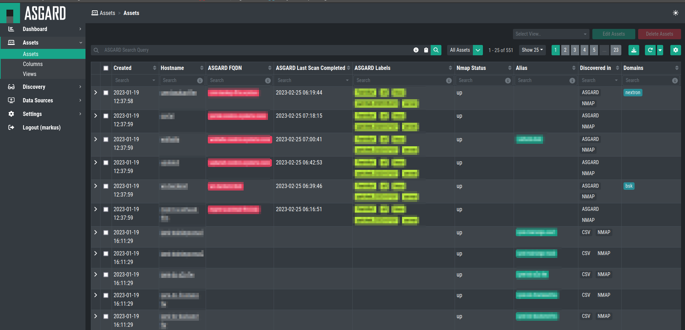

.. index:: Assets

Assets
======

In the ``Assets`` section you will find all imported assets. You can also
use the ASGARD Search Query to find assets.

You will also be able to change the View in the top right corner.
To create a new view, please see :ref:`assets/views:views`.

.. hint:: 
   If you created a personalized view and use it, all the column 
   settings and ordering of columns will be saved.