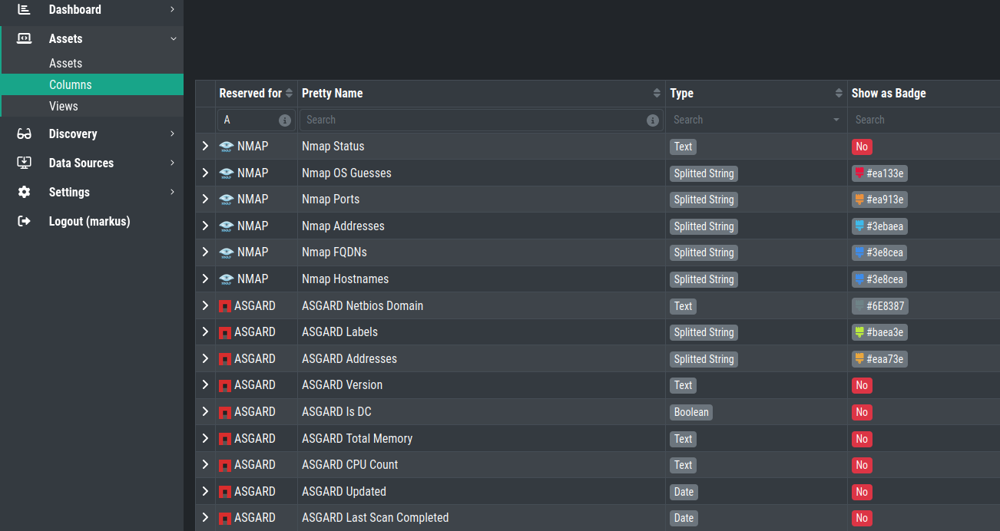

Columns
=======

The Column View gives you the option to define new columns for your view.
The Inventory Analyzer comes with predefined and non removable columns.

Creating new Columns
~~~~~~~~~~~~~~~~~~~~

To create a new Columns, click the ``Add Column`` button in the top right corner.

You can chose between different Column Types:

.. list-table:: 
    :header-rows: 1
    :widths: 25, 75

    * - Column Type
      - Options
    * - Text
      - Normal Text. If ``Show as Badge`` is enabled, your text will be surrounded by colored
        background
    * - Splitted String
      - String is split into multiple badges with the chosen color. Separator can be defined
    * - Boolean
      - True or False, for searching
    * - Multi Select
      - Multiple Values can be defined and selected in for the Column. If ``Show as Badge``
        is enabled, your text will be surrounded by colored background
    * - Date
      - Date field (XYZ Format?)

