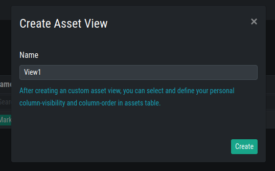

.. index:: Views

Views
=====

In the ``Views`` section you can create personal Asset Views.
Those views are used to save a current view in the ``Assets``
section. All the views are personalized, meaning they are 
only visible by your user.

To create a new personalized view, click the ``Create Asset
View`` button and give the view a name.

You can now choose the view in the ``Assets`` section. When
choosing a view and changing column visibility or sort order,
the changes will be saved to this view.

