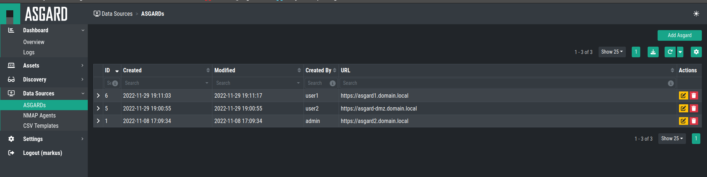

ASGARDs
=======

The ASGARD data source are your existing ASGARDs. You can use them
to directly import any asset which is known to your ASGARDs.

To do this, navigate to ``Data Sources`` > ``ASGARDs``.

You can see your connected ASGARDs in the overview, or add a new ASGARD 
as a data source.

Adding a new ASGARD
~~~~~~~~~~~~~~~~~~~

To add a new ASGARD to your data sources, click the ``Add ASGARD`` button.
Here you can set the ``URL`` and ``API Key``.

You can now use this ASGARD as Data Source for a new Discovery Task. Please
see chapter :ref:`discovery/tasks:tasks`.