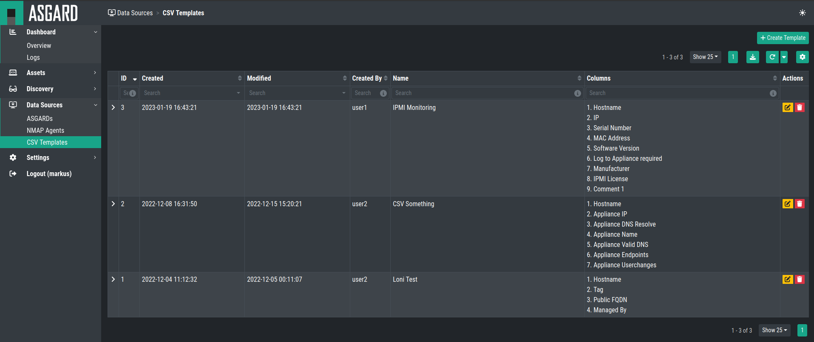
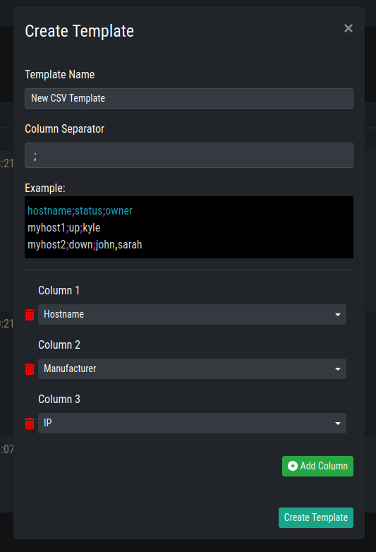

CSV Templates
=============

You can also create CSV Templates to import assets.

You can freely design multiple templates to your liking
and import the data later.

To do this, navigate to ``Data Sources`` > ``CSV Templates``.

You will see all currently existing CSV Templates, but also be able
to create a new template by clicking ``+ Create Template`` in the
top right corner.

Creating a new CSV Template
~~~~~~~~~~~~~~~~~~~~~~~~~~~

When creating a new template, you will be able to customize how the 
structure of the CSV file should look like.

Chose your ``Column Separator`` and ``Columns`` as you need. Please keep
in mind, that you can choose any column, either system defaults or manually
created ones. Please see chapter :ref:`assets/columns:columns`.

After creating your CSV template, you can later use it while creating a new
``CSV Template Task``. Please see chapter :ref:`discovery/tasks:tasks`.