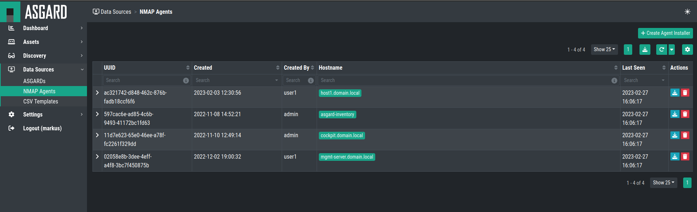
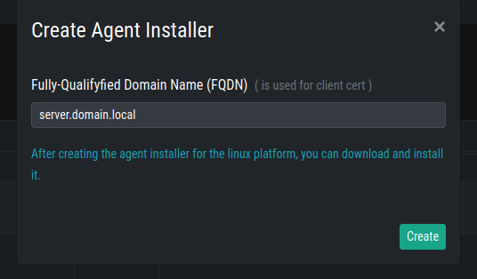

NMAP Agents
===========

We crated an NMAP Agent which can be installed and used on endpoints 
to be used for Discovery. This Agent can scan a IP subnet to detect
and inventory endpoints/assets.

To do this, navigate to ``Data Sources`` > ``NMAP Agents``.

You will see all currently created NMAP Agents, but also be able
to create a new one by clicking ``+ Create Agent Installer`` in the
top right corner.

You will also be able to see when the Agent communicated the last
time with your Inventory Analyzer (Last Seen).

Creating a new NMAP Agent Installer
~~~~~~~~~~~~~~~~~~~~~~~~~~~~~~~~~~~

When creating a new NMAP Agent Installer, you will need to provide a FQDN.
This is needed for the Client Certificate, which will be built into the 
Agent. This Client Certificate is used for TLS communication with your
Inventory Analyzer.

After specifying your FQDN, you can click ``Create`` to create your new
NMAP Agent Installer.

After creating and installing your NMAP Agent, you can later use it while creating a new
``NMAP Agent Task``. -> REF HERE

.. hint::
  Unused Agent Installers can be deleted if they are no longer needed.

Installing an NMAP Agent
~~~~~~~~~~~~~~~~~~~~~~~~

The created NMAP Agent Installer is a ``.deb`` file. You should be able to install it
on any debian based linux distribution. Download the file and transfer it to your
chosen server. 

You can install it via dpkg:

.. code-block:: console

    nextron@server:~$ sudo dpkg -i server.domain.local_agent.deb 
    [sudo] password for nextron: 
    Selecting previously unselected package asgard-inventory-agent.
    (Reading database ... 71802 files and directories currently installed.)
    Preparing to unpack server.domain.local_agent.deb ...
    Unpacking asgard-inventory-agent (1.0.0~pre+20221101.0) ...
    Setting up asgard-inventory-agent (1.0.0~pre+20221101.0) ...
    Created symlink /etc/systemd/system/multi-user.target.wants/asgard-inventory-agent.service → /lib/systemd/system/asgard-inventory-agent.service.

You can check if the Inventory Analyzer Agent is running:

.. code-block:: console

    nextron@server:~$ systemctl status asgard-inventory-agent.service 
    ● asgard-inventory-agent.service - ASGARD Inventory Agent
         Loaded: loaded (/lib/systemd/system/asgard-inventory-agent.service; enabled; vendor preset: enabled)
         Active: active (running) since Mon 2023-02-27 15:19:58 UTC; 1min 10s ago
       Main PID: 3027 (bash)
          Tasks: 6 (limit: 14230)
         Memory: 2.0M
         CGroup: /system.slice/asgard-inventory-agent.service
                 ├─3027 /bin/bash /etc/asgard-inventory-agent/run_asgard_inventory_agent.sh
                 └─3029 asgard-inventory-agent run

    Feb 27 15:19:58 server systemd[1]: Started ASGARD Inventory Agent.
    Feb 27 15:19:58 server asgard-inventory-agent[3029]: 2023/02/27 15:19:58 {"CA":"/etc/asgard-inventory-agent/ca-inventory.pem","HOST":"0.0.0.0","KEY":"/etc/asgard-inventory-agent/se>

Uninstall an NMAP Agent
~~~~~~~~~~~~~~~~~~~~~~~

To uninstall your NMAP Agent from an endpoint, run the following command:

.. code-block:: console

    nextron@server:~$ sudo apt remove asgard-inventory-agent
    [sudo] password for nextron: 
    Reading package lists... Done
    Building dependency tree       
    Reading state information... Done
    The following packages will be REMOVED:
      asgard-inventory-agent
    0 upgraded, 0 newly installed, 1 to remove and 41 not upgraded.
    After this operation, 22.0 MB disk space will be freed.
    Do you want to continue? [Y/n] y
    (Reading database ... 71815 files and directories currently installed.)
    Removing asgard-inventory-agent (1.0.0~pre+20221101.0) ...
    nextron@server:~$ sudo rm -r /var/lib/asgard-inventory-agent

