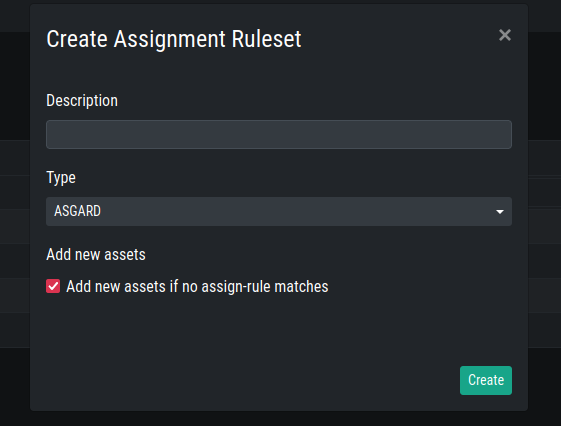
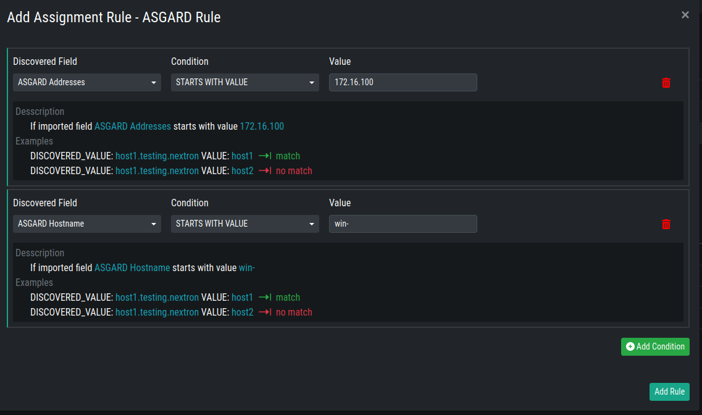
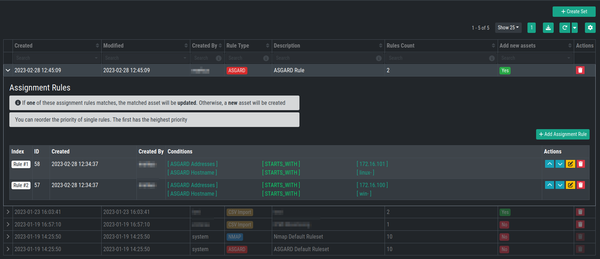

Assignment Rules
================

Assignment Rules are used to determine if an existing asset should be
updated, or if a new asset should be created instead.

Your system comes with two predefined Assignment Rules, one for ASGARDs
and one for NMAP, which cannot be deleted or changed.

You can create Assignment Rules based on a Rule Type. Those Rule Types
are the same as your Data Sources: :ref:`data/asgard:asgards`, 
:ref:`data/nmap_agents:nmap agents` and :ref:`data/csv_templates:csv templates`.

Creating Assignment Rules
~~~~~~~~~~~~~~~~~~~~~~~~~

An Assignment Rule is stored inside an Assignment Set. One Assignment
Set can contain multiple Assignment Rules. One Assignment Rule can contain 
multiple Conditions.

To create new Assignment Set, click ``+ Create Set`` in the top
right corner. You will be able to set a ``Description`` and a ``Type``.

You also have the option to set ``Add new assets if no assign-rule matches``.
This option is helpful if you want to add new assets to the inventory analyzer.

This will create a new Assignment Set, which in turn can then be used
to Add Assignment Rules to it.

Expand your Set on the left hand side, you will see that no rules are
defined yet.

Create a new Assignment Rule by clicking ``Assignment Rule``. You can
specify conditions for this specific Assignment Rule.

In our example we created:

* An Assignment Set with the type ``ASGARD``
* An Assignment Rule within the ``ASGARD`` Assignment Set
* The rule contains the following conditions:

   *  If imported field ``ASGARD Addresses`` starts with value ``172.16.100``
   *  If imported field ``ASGARD Hostname`` starts with value ``win-``

This means, if we create a Task to run a Discovery on one of our ASGARDs,
and an asset with the IP ``172.16.100.22`` and Hostname ``win-example-01``
is found, it will be added to our inventory. If the asset was already
present in our inventory, it will be updated.

You can reorder the priority of single rules. The first has the highest priority.

.. note::
    Conditions within a rule are connected with an ``AND`` operator.
    Rules within a set are connected with an ``OR`` operator.

You can change the order of the Rules within your Set. To do this, you can
use the Action Buttons on the right hand side.

