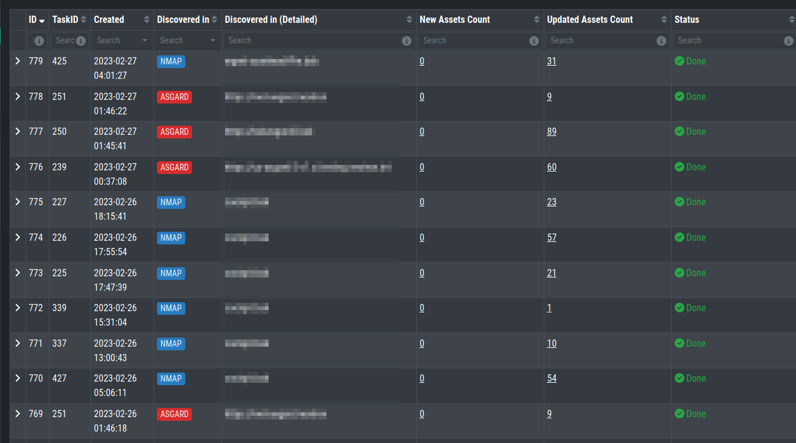
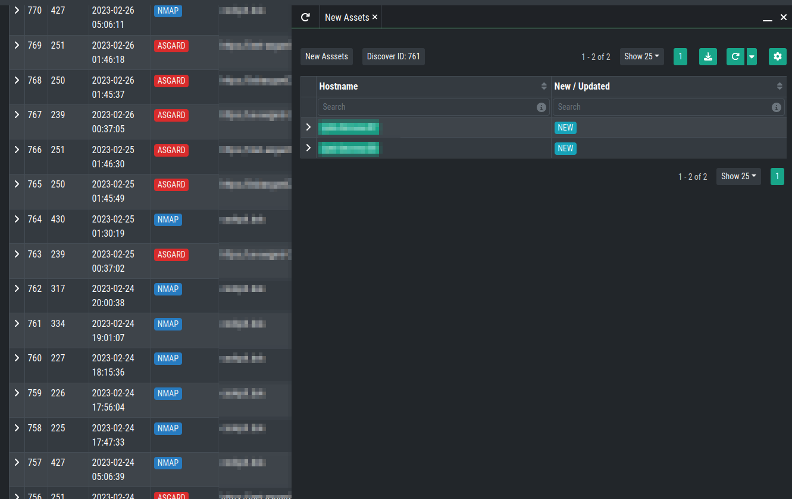
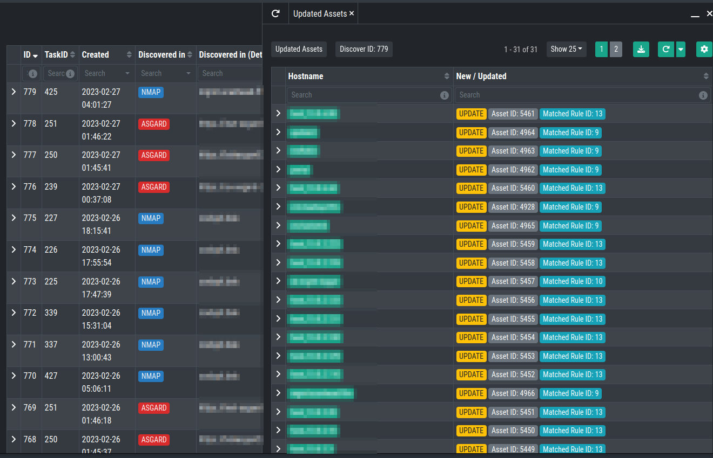

.. index:: History

History
=======

The Discovery History shows you all the Tasks which ran
on your Inventory Analyzer. Here you can see which Data
Source the tasks used (Discovered In), if new Assets were
found or existing ones were updated, and the status of
the Task. You can also see which Template was used and
the NMAP Arguments of the your NMAP Task.

To see the New Assets from a Task, click on the number
in the ``New Assets Count`` Column.

To see the Updates Assets from a Task, click on the number
in the ``Updates Assets Count`` Column. You can see which
Rule triggered the Update.

