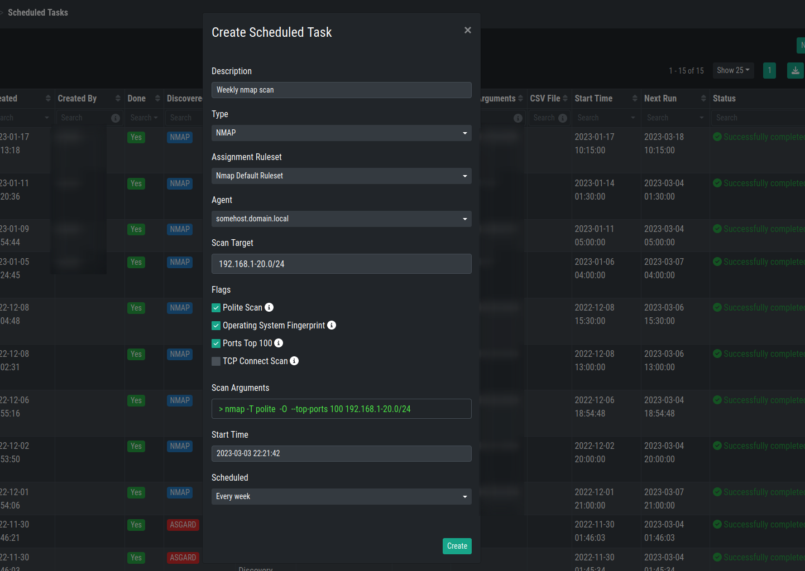

.. index:: Scheduled Tasks

Scheduled Tasks
===============

Scheduled Tasks are identical to normal tasks with the only exception
to configure them for a specific Start Time and a schedule.

You can choose between the following Schedules:

.. list-table:: 
    :header-rows: 1

    * - Schedule
    * - No (run only once) 
    * - Every day
    * - Every 2 days
    * - Every 4 days
    * - Every week
    * - Every 2 weeks
    * - Every 3 weeks
    * - Every month
    * - Every 2 months

The overview will show you all of the scheduled tasks.

.. hint:: 
   The result of a scheduled NMAP Task can be downloaded (XML file).