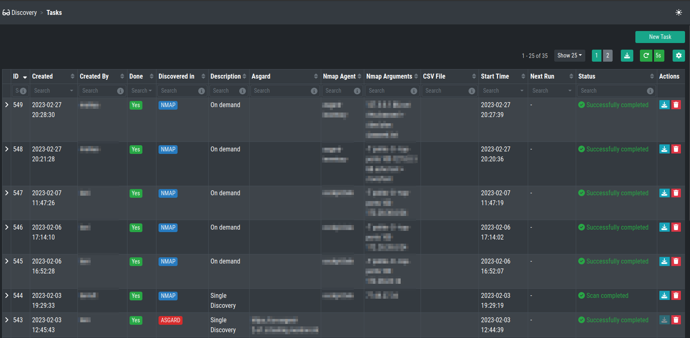
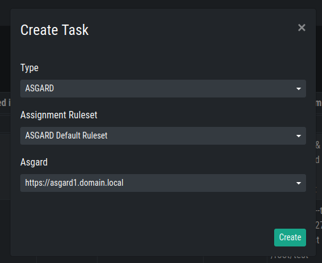
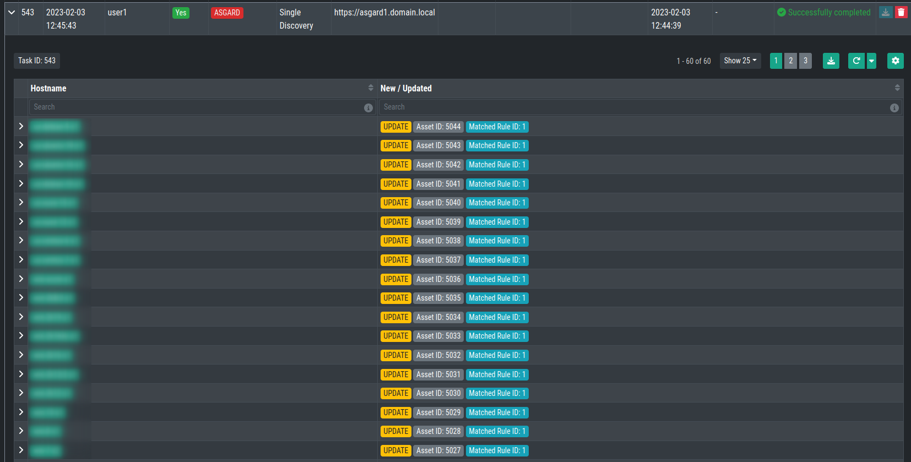
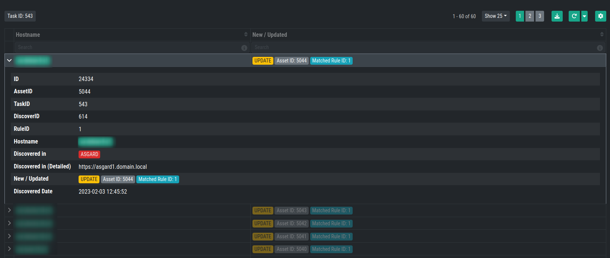
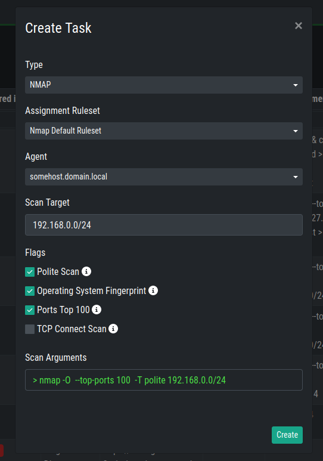
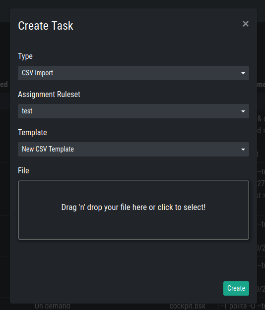
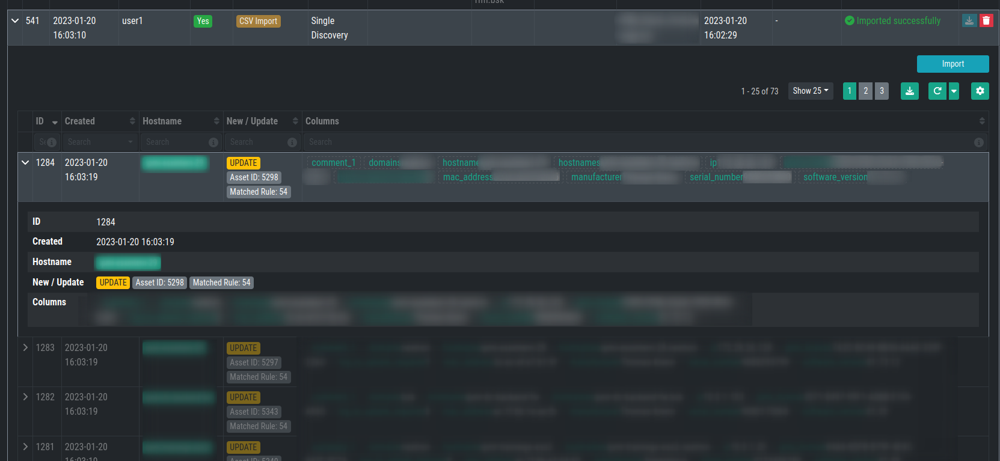

.. index:: Tasks

Tasks
=====

Within the Tasks section of the Discovery menu, you can create on
time tasks to search for new assets. Those tasks will only run once.

There are three different type of tasks, which are identical to your
Data Sources:

* ASGARD
* NMAP Agent
* CSV Import

ASGARD Task
~~~~~~~~~~~

The ASGARD Task will scan the selected ASGARD instance for all available,
or rather connected, assets. How the assets are assigned will depend on your
assignment rule. 

After your task has finished, you can inspect the results:

You can also inspect the details of the found hostnames. Those details contain
what RuleID matched in the task, where it was discovered and more.

NMAP Task
~~~~~~~~~

The NMAP Task will run an nmap scan from the defined data source. You have to 
provide the assignment ruleset, the agent and a scan target. The scan target can
be in the following format:

* FQDN, for example ``myhost.domain.local``
* Single IP, for example ``192.168.0.122``
* Subnets, for example ``192.168.0.0/24``
* Comma Separated, for example ``192.168.0.1,5,10``

   * This would scan the hosts ``192.168.0.1``, ``192.168.0.5`` and ``192.168.0.10``

* Ranges, for example ``192.168.1-10.1``

   * This would scan the hosts ``192.168.1.1`` until ``192.168.10.1``

* Or combinations, for example ``192.168.0-10,20,30.1-20,30,40``
* You can use a combination of all of the above, for example ``myhost.domain.local 192.168.0.0/4 192.168.1-10.1-254``

For the Flags we also have a few predefined options:

* **Polite Scan** - Scan my take ten times longer than a default scan. This is recommended for cautious (less aggressive) scans.

* **Operating System Fingerprint** - Using TCP/IP stack fingerprinting. Nmap sends a series of TCP and UDP packets to the remote host and examines practically every bit in the responses.

* **Ports Top 100** - This option specifies the number of ports to 100 to scan in each protocol. This will pick the most popular ports for you based on the new frequency data. Default is **1000**

* **TCP Connect Scan** - TCP connect scan is the default TCP scan type when SYN scan is not an option. This is the case when a user does not have raw packet privileges

After choosing your input, you will see the Scan Arguments on the bottom.

You can inspect the results of your task just like any other task.

.. hint:: 
   The result of a NMAP Task can be downloaded (XML file).

CSV Import
~~~~~~~~~~

The CSV Import lets you upload a CSV file and import that way assets.

You can again chose an assignment ruleset and a template.

Inspecting the task will show you the columns which were used to import
the file with additional information.

