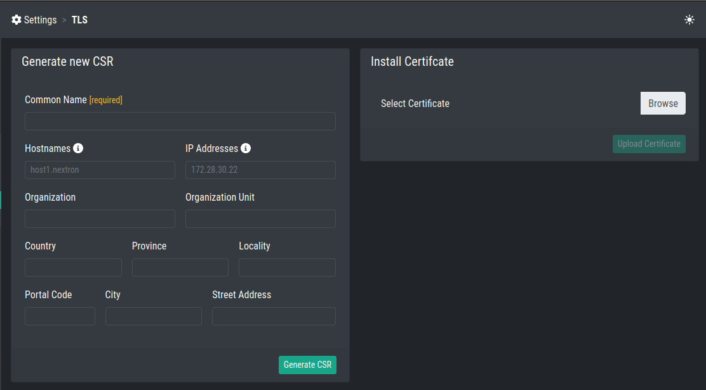

TLS
===

You can install a TLS Certificate to avoid browser warnings when
using your Inventory Analyzer.

To do this, navigate to ``Settings`` > ``TLS``.

You need to generate a CSR (Certificate Signing Request) and 
let the CSR sign by your CA (Certificate Authority). Afterwards, 
you can install the certificate - generated and signed from your
CA - in the same page.

Generating a CSR
~~~~~~~~~~~~~~~~

To generate a CSR for your Certificate Authority, just fill in the
correct information into the text fields. Most importantly is the 
``Common Name`` field. ``Hostnames`` and ``IP Addresses`` are not
needed, but are often used in organizations (subjectAlternativeName).

After filling out the information, click ``Generate CSR``. You will
be able to download the CSR now.

