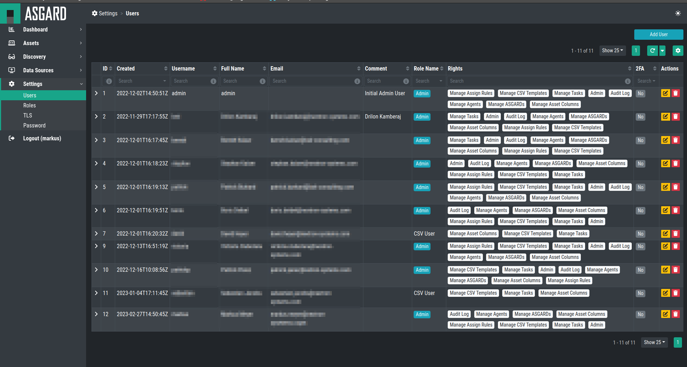

.. index:: Users

Users
=====

In the Users section, you will be able to review, create or delete users.

To create a new user, just click ``Add User`` in the top right corner
and fill out the information. Roles can be created in the :ref:`settings/roles:roles`
view.