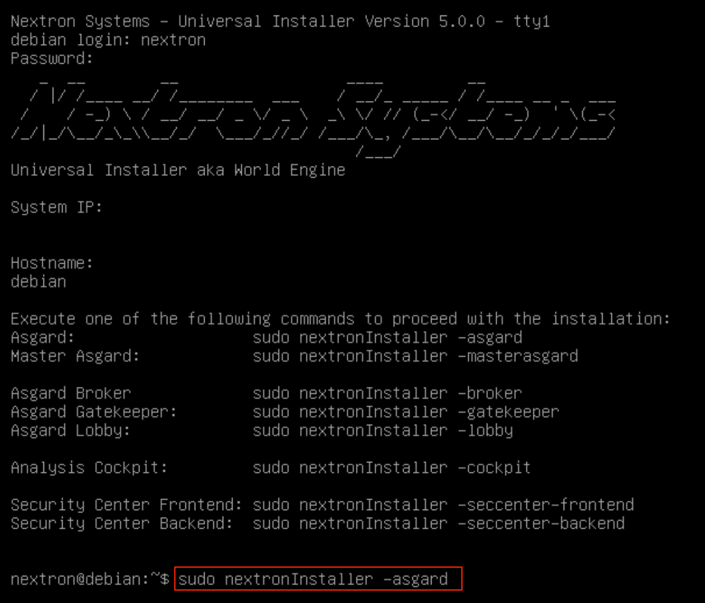

.. index:: Install Inventory Analyzer

Install the Inventory Analyzer Service
======================================

Use SSH to connect to the appliance using the user ``nextron`` and the password you
specified during the installation (if you were using an old ISO to install the base
system, the password is ``nextron``). Now you can run the following command: 

``sudo nextronInstaller -asgard`` (caution: upper case “i" in the middle). This will install ASGARD.

After installation is complete type ``sudo systemctl status asgard2``. 

The output should look like the screenshot below with status ``Active``.

.. figure:: ../images/setup_service.png
   :alt: systemctl status asgard2

Installation is complete, you are ready to log into the web-based GUI.

.. index:: Changing IP-Address

Changing the IP-Address
=======================

ASGARD's IP-Address can be changed in **/etc/network/interfaces**. The IP is configured with the address variable.

.. code-block:: console

   nextron@asgard:~$ sudo vi /etc/network/interfaces

.. code-block:: none

   auto ens32
   iface ens32 inet static
   address 192.0.2.7
   netmask 255.255.255.0
   gateway 192.0.2.254

Important: There might be a case where the name of the network adaptor (in this example: ``ens32``) can vary.

The new IP can be applied with the command **sudo systemctl restart networking**

.. index:: Verify DNS Settings

Verifying DNS Settings
----------------------

To verify if ASGARD is using the correct DNS Server, you can inspect the file ``/etc/resolv.conf``:

.. code-block:: console

   nextron@asgard:~$ cat /etc/resolv.conf 
   search example.org
   nameserver 172.16.200.2

If you see errors in this configuration, you can change it with the following command:

.. code-block:: console

   nextron@asgard:~$ sudoedit /etc/resolv.conf
