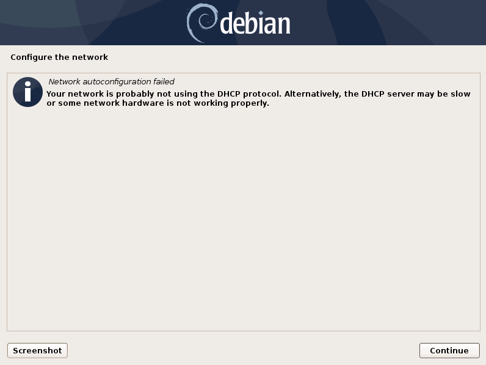
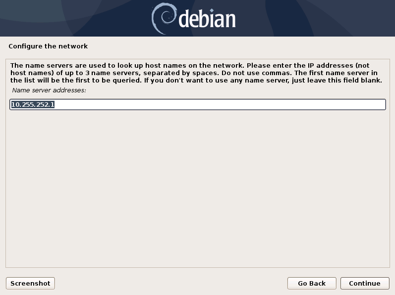
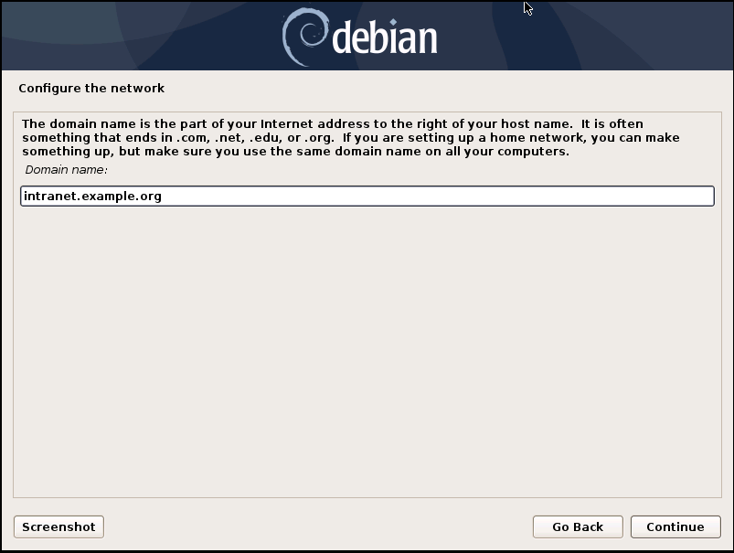

Network Configuration
=====================

.. figure:: ../images/setup_network2.png
   :alt: Configure the network

.. figure:: ../images/setup_network3.png
   :alt: Configure the network

.. warning::
   ASGARD needs to be able to resolve internal and external IP addresses.

.. figure:: ../images/setup_network5.png
   :alt: Configure the network

.. figure:: ../images/setup_network6.png
   :alt: Configure the network

.. warning::
   **Important:** Make sure that the combination of hostname and domain creates
   an FQDN that can be resolved from the endpoints on which you intend to install
   the ASGARD agents. If you've configured a FQDN (hostname + domain) that cannot
   be resolved on the clients, no agent will be able to find and connect to the ASGARD server. 

